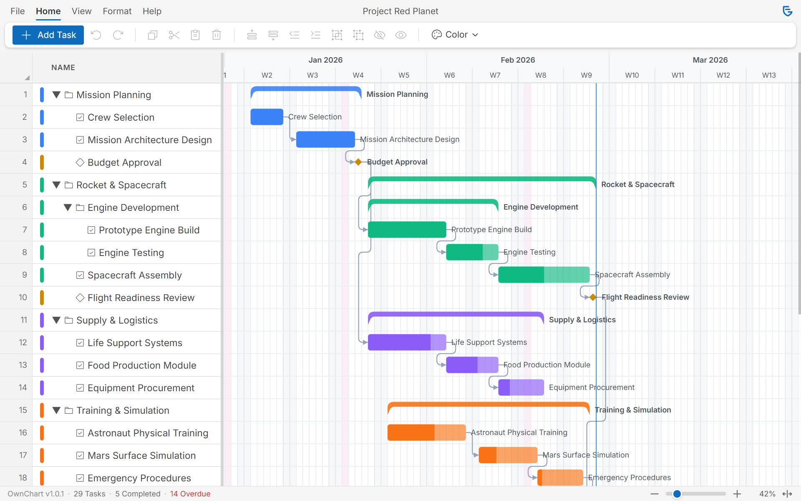

# OwnChart

> **Privacy-first, offline Gantt chart for project planning. Own your data.**

[](https://github.com/kitikonti/ownchart/actions/workflows/ci.yml)
[](https://github.com/kitikonti/ownchart/releases)
[](LICENSE)
[](https://www.typescriptlang.org/)
[](https://react.dev)
[](https://github.com/sponsors/kitikonti)

**OwnChart** is a browser-based Gantt chart application that respects your privacy. No cloud, no tracking, no accounts. Your data stays on your device.



## Get Started

**Use OwnChart now**: [ownchart.app](https://ownchart.app)

No installation needed — open the app and start planning. Your data stays in your browser's local storage, or save it as a `.ownchart` file to keep full control.

## Features

### Privacy & Data Ownership
- **100% Local** — All data stays on your device, nothing is sent to any server
- **Zero Tracking** — No analytics, no telemetry, no cookies
- **No Accounts** — No sign-up, no login, no email required
- **File-Based** — Save/load `.ownchart` files you own and control
- **Open Source** — Fully auditable MIT-licensed code

### Timeline & Editing
- **Drag-to-Move & Resize** — Interactive task bars on the timeline
- **Task Dependencies** — Finish-to-Start links with automatic date propagation
- **Multi-Task Drag** — Move all selected tasks together
- **Summary Task Drag** — Moving a summary moves all its children
- **Infinite Scroll** — Timeline auto-extends as you scroll past/future
- **Zoom** — 5% to 300% with cursor-centered anchoring

### Project Organization
- **Task Hierarchy** — Summaries, milestones, and regular tasks (3 levels deep)
- **Multi-Select** — Ctrl/Shift+Click or rectangular marquee selection
- **Copy/Paste** — Cross-tab clipboard with dependencies preserved
- **Insert Tasks** — Add above/below with toolbar buttons or placeholder row
- **Undo/Redo** — 100-step command history for all operations

### Export
- **PNG Export** — High-resolution raster images
- **PDF Export** — Vector graphics that scale perfectly for large prints
- **SVG Export** — Editable vector output
- **Live Preview** — Figma-style export dialog with real-time preview
- **Page Options** — A4, A3, Letter, Legal, Tabloid with orientation and margins

### Customization
- **5 Color Modes** — Manual, Theme, Summary Group, Task Type, Hierarchy
- **UI Density** — Compact, Normal, or Comfortable row heights
- **Holiday Support** — 199 countries with timeline highlighting
- **Working Days Mode** — Business day calculations for scheduling
- **Task Labels** — Position before, inside, after, or hide labels
- **View Toggles** — Show/hide today marker, weekends, holidays, dependencies, progress

### User Experience
- **Ribbon UI** — MS Office-style tabbed interface (File, Task, View, Help)
- **Keyboard Shortcuts** — Efficient navigation and editing
- **Help Panel** — Built-in shortcut reference (press `?`)
- **Welcome Tour** — Guided introduction for first-time users
- **Security** — 6-layer file validation against XSS/injection

## Keyboard Shortcuts

| Shortcut | Action |
|----------|--------|
| `Ctrl+Z` | Undo |
| `Ctrl+Shift+Z` / `Ctrl+Y` | Redo |
| `Ctrl+C` / `Ctrl+V` / `Ctrl+X` | Copy / Paste / Cut |
| `Ctrl+A` | Select all tasks |
| `Del` | Delete selected tasks |
| `Tab` / `Shift+Tab` | Indent / Outdent |
| `F` | Fit timeline to view |
| `T` | Toggle today marker |
| `D` | Toggle dependencies |
| `P` | Toggle progress |
| `H` | Toggle holidays |
| `?` | Open help panel |

## Browser Support

| Browser | Minimum Version |
|---------|----------------|
| Chrome / Edge | 90+ |
| Firefox | 88+ |
| Safari | 14+ |

Works on Windows, macOS, and Linux.

## Quick Start (Development)

```bash
# Clone the repository
git clone https://github.com/kitikonti/ownchart.git
cd ownchart

# Install dependencies
npm install

# Start development server
npm run dev
```

Open [http://localhost:5173](http://localhost:5173) to start developing.

## Tech Stack

- **React 18** — UI framework with hooks
- **TypeScript** — Type-safe development
- **Zustand** — Lightweight state management
- **TailwindCSS** — Utility-first styling
- **Vite** — Lightning-fast build tool
- **D3.js** — Timeline rendering
- **Vitest + Playwright** — Comprehensive testing

## Scripts

```bash
npm run dev              # Start dev server
npm run build            # Production build
npm run preview          # Preview production build

npm run lint             # Lint code
npm run format           # Format with Prettier
npm run type-check       # TypeScript validation

npm run test:unit        # Unit tests with coverage
npm run test:e2e         # E2E tests with Playwright

npm run ci:local         # Run all checks (pre-commit)

npm run release          # Create new release with changelog
```

## Project Structure

```
ownchart/
├── src/
│   ├── components/      # React components
│   ├── store/          # Zustand state slices
│   ├── utils/          # Helper functions
│   ├── types/          # TypeScript definitions
│   └── hooks/          # Custom React hooks
├── tests/              # Unit, integration, E2E tests
├── docs/               # Comprehensive documentation
└── CLAUDE.md           # AI assistant guide
```

## Documentation

Comprehensive documentation is available in the [`/docs`](./docs) folder:

- **[Product Requirements](./docs/planning/PRD.md)** — Vision and requirements
- **[Roadmap](./docs/planning/ROADMAP.md)** — Development phases
- **[Technical Architecture](./docs/architecture/TECHNICAL_ARCHITECTURE.md)** — System design
- **[Data Model](./docs/architecture/DATA_MODEL.md)** — Data structures
- **[Testing Strategy](./docs/process/TESTING_STRATEGY.md)** — QA approach
- **[CI/CD Pipeline](./docs/process/CI_CD.md)** — Deployment process

## Security & Privacy

OwnChart is designed with privacy as the foundation:

- **Zero Telemetry** — No analytics, no tracking
- **Local-Only** — No data ever leaves your device
- **No Accounts** — No sign-up, no login required
- **File Validation** — 6-layer security pipeline (XSS, prototype pollution prevention)
- **Open Source** — Fully auditable code

## Current Status

**v1.0 milestone reached** — OwnChart is stable and feature-complete for professional Gantt chart creation and editing. See the [changelog](./CHANGELOG.md) for details.

**Next Up (V1.1)**:
- Advanced dependencies (Start-to-Start, Finish-to-Finish, Start-to-Finish)
- Custom fields UI
- Multi-project management
- Named snapshots

See the [Roadmap](./docs/planning/ROADMAP.md) for the full development plan.

## Contributing

Contributions are welcome! Please read our [contributing guidelines](./CONTRIBUTING.md) before submitting PRs.

**Development Workflow**:
1. Fork the repository
2. Create your feature branch (`git checkout -b feature/amazing-feature`)
3. Commit your changes (`git commit -m 'feat: add amazing feature'`)
4. Push to the branch (`git push origin feature/amazing-feature`)
5. Open a Pull Request

**Commit Convention**: We use [Conventional Commits](https://www.conventionalcommits.org/) for automated changelog generation.

## License

[MIT License](LICENSE) — Feel free to use OwnChart for any purpose.

## Links

- **App**: [ownchart.app](https://ownchart.app)
- **Repository**: [github.com/kitikonti/ownchart](https://github.com/kitikonti/ownchart)
- **Issues**: [Report a bug or request a feature](https://github.com/kitikonti/ownchart/issues)
- **Changelog**: [See what's new](./CHANGELOG.md)

---

**Built with care for privacy-conscious project managers.**

**OwnChart** — Because your project data belongs to you, not in someone else's cloud.
